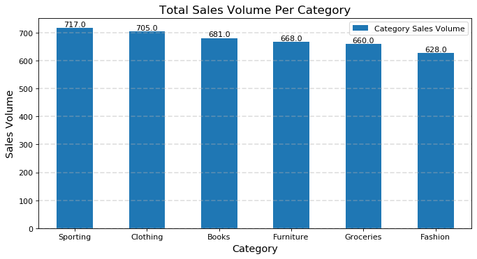

# Supermarket_Analysis

 

  

Image Credit: https://www.deviantart.com/oraclesaturn/art/Market-Background-659914879

## Introduction
A supermarket is a self-service shop offering a wide variety of items like sporting, clothing, books, furniture, groceries, and fashion. It is larger and has a wider selection than earlier grocery stores, but is smaller and more limited in the range of merchandise than a hypermarket.

Here I have used different techniques to visualize the data set of the supermarket.  
What will you discover from this analysis?

- Average monthly Consumption
- Average Monthly Consumption Amount
- Customer unit price
- Consumer Trends

## Kaggle Dataset Information

The dataset is very useful for beginners and novice number crunchers looking to run queries in a relatable and easy-to-understand dataset. It includes the data about shoppers of a supermarket chain having different locations and the total of their purchases.

Dataset link: https://www.kaggle.com/marahim20/sales-dataset-of-supermarket  
Dataset Credit: Minhaj Abdul Rahim

## Summary and suggestions (CONCLUSION)

#### 1. Descriptive Analysis

- The average monthly consumption is 341.3 times.
- The average monthly consumption amount is $ 207788.
- The Customer unit price is $ 208.

#### 2. Exploratory Data Analysis

Monthly sales conclusion: March the peak sales season.

  

  

Weekly sales conclusion: Overall, the peak sales on Monday, and Friday match people's weekly work cycle, and the lowest sales on Sunday, probably because the customer wants to rest at home and prepare to work on Monday.

  

  

Daily sales conclusion: There will be obvious peaks and troughs, on the whole, typical peaks are periodic within a certain error range, and the peak points can be extracted separately, query the date of the day, marketing plans, holidays, and other factors to analyze and explore sales.

  

  

Top Category by Volume: Sporting and Clothing 

  

  

Top Category by Sales: Sporting and Books 

  

  
